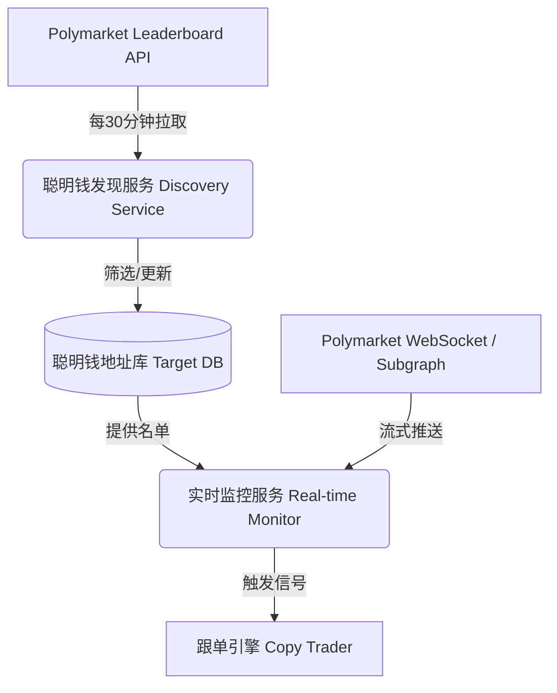

# 聪明钱发现与监控系统 (Smart Trader Discovery & Monitoring)

## 1. 系统架构概览

本系统旨在解决"如何发现并利用 Polymarket 上的高盈利交易员（聪明钱）"的问题。
基于对 Polymarket API 的测试与分析，我们将系统拆分为两个独立的模块：**低频发现层** 和 **高频监控层**。



---

## 2. 模块详解

### 2.1 聪明钱发现服务 (Discovery Module)

*   **目标**: 维护一份高质量的"聪明钱"钱包地址名单。
*   **数据源**: `GET https://data-api.polymarket.com/v1/leaderboard`
*   **特性**: 数据非实时（快照更新），但覆盖面广。
*   **运行频率**: 建议 **每 10 - 60 分钟** 运行一次 (Crontab / 调度任务)。
*   **核心逻辑**:
    1.  **拉取**: 获取 PnL (盈亏) 榜单 Top 500 - 1000 的用户。
    2.  **清洗**: 调用 `Gamma API` 获取用户详细资料，剔除已知官方做市商或无效账号。
    3.  **筛选**:
        *   `PnL > $10,000` (确保盈利规模)
        *   `Volume > $50,000` (排除"一击即中"的运气型选手)
        *   *(可选)* 计算近期胜率 (需结合 Subgraph 数据)。
    4.  **存储**: 将符合标准的地址存入数据库 `active_smart_wallets` 表。

### 2.2 实时监控服务 (Monitoring Module)

*   **目标**: 毫秒级捕捉目标地址的开仓动作。
*   **数据源**: 
    *   **CLOB WebSocket** (`/ws/market`): 监听订单成交 (Fills)。
    *   **Subgraph** (备选): 监听链上 `OrderFilled` 事件。
*   **运行模式**: 常驻进程 (Daemon)。
*   **核心逻辑**:
    1.  **初始化**: 从数据库加载监控名单。
    2.  **订阅**: 建立 WebSocket 连接，筛选 `maker` 或 `taker` 为目标地址的事件。
    3.  **分析**: 
        *   识别买入/卖出方向（Buy Yes / Buy No）。
        *   过滤金额过小的噪音交易。
    4.  **触发**: 一旦命中策略，立即向跟单引擎发送信号。

---

## 3. 已实现模块

### 3.1 文件结构

```
Find_user/
├── discovery_config.py       # 配置文件（筛选阈值、API参数）
├── fetch_leaderboard.py      # 排行榜数据抓取脚本
├── smart_trader_analyzer.py  # 聪明钱分析与筛选
├── polymarket_data_fetcher.py # 通用 API 工具类
├── find_smart_traders.py     # 基于市场扫描的查找方式（旧版）
├── output/                   # 输出目录
│   ├── leaderboard_*.csv     # 排行榜原始数据
│   ├── smart_traders_*.csv   # 筛选后的聪明钱
│   └── smart_wallets_*.json  # 钱包地址列表
└── README.md
```

### 3.2 快速开始

```powershell
# 1. 抓取排行榜数据 (Top 1000)
python fetch_leaderboard.py --max-traders 1000

# 2. 分析并筛选聪明钱
python smart_trader_analyzer.py

# 3. 使用预设配置
python smart_trader_analyzer.py --preset aggressive  # 严格筛选
python smart_trader_analyzer.py --preset relaxed     # 宽松筛选
```

### 3.3 命令行参数

#### fetch_leaderboard.py

| 参数 | 说明 | 默认值 |
|------|------|--------|
| `--category` | 市场分类 (OVERALL/POLITICS/SPORTS/CRYPTO等) | OVERALL |
| `--time-period` | 时间周期 (DAY/WEEK/MONTH/ALL) | ALL |
| `--max-traders` | 最大获取交易者数量 | 1000 |
| `--enrich-profiles` | 获取额外的用户资料信息 | False |
| `--all-categories` | 抓取所有分类 | False |

#### smart_trader_analyzer.py

| 参数 | 说明 | 默认值 |
|------|------|--------|
| `--input` | 输入文件路径 (CSV/JSON) | 自动使用最新 |
| `--min-pnl` | 最低盈亏阈值 | $10,000 |
| `--min-volume` | 最低交易量阈值 | $50,000 |
| `--min-win-rate` | 最低胜率 | 50% |
| `--min-positions` | 最少已平仓数量 | 5 |
| `--workers` | 并行线程数 | 10 |
| `--preset` | 预设配置 (default/aggressive/relaxed) | default |

### 3.4 输出说明

分析完成后会生成以下文件：

1. **smart_traders_*.csv** - 详细的聪明钱信息，包含：
   - 钱包地址、PnL、交易量、ROI
   - 胜率、总交易数、盈利/亏损交易数
   - 持仓集中度等风险指标

2. **smart_wallets_*.json** - 纯钱包地址列表，可直接用于监控模块

3. **all_analyzed_*.csv** - 所有分析过的候选人数据（含被过滤的）

---

## 4. 使用的 API 端点

| API | 端点 | 用途 |
|-----|------|------|
| **Data API** | `/v1/leaderboard` | 获取交易者排行榜 |
| **Data API** | `/v1/closed-positions` | 获取用户已平仓记录 |
| **Data API** | `/positions` | 获取用户当前持仓 |
| **Data API** | `/trades` | 获取交易记录 |
| **Gamma API** | `/public-profile` | 获取用户公开资料 |

## 5. API 限制注意事项

*   **Leaderboard API**: 
    *   分页 `offset` 最大支持到 1000
    *   每次 `limit` 最大 50
    *   数据不是实时的，不要用于"即时跟单"
*   **Rate Limits**: 内置延迟机制 (0.2-0.3秒/请求) 以避免限速
*   **Positions API**: `offset` 最大 10000

---

## 6. 开发路线图

- [x] **Phase 1: 发现脚本 (Scraper)** - `fetch_leaderboard.py`
- [x] **Phase 2: 筛选分析 (Analyzer)** - `smart_trader_analyzer.py`
- [ ] **Phase 3: 跟单模拟 (Simulation)** - `smart_follower_sim.py` (New)
- [ ] **Phase 4: 监控连接 (Connector)** - 对接 `user_listener` 模块

## 7. 聪明钱跟单模拟 (Smart Follower Simulation) - [Proposed]

为了验证筛选出的"聪明钱"是否值得跟随，我们将增加一个模拟演算模块。主要用于回测和验证跟单的预期收益率。

### 7.1 核心思想

**"按照一定滑点跟最近 X 单，判断模拟盈亏。"**

核心逻辑分为三步：
1.  **获取历史动作**: 拉取目标钱包最近的 X 笔交易 (Trades)。
2.  **模拟跟单成本**: 假设我们在该用户交易的同一时刻跟单，计算我们的入场成本 (Entry Cost)。
    *   *Slippage (滑点)*: 这里的滑点指的是相对于"聪明钱成交价"的溢价。
    *   `Simulated Entry Price = Trader Execution Price * (1 + Slippage %)`
3.  **计算当前价值 (Mark to Market)**: 使用 CLOB Orderbook 的深度数据，计算如果我们现在平仓能卖多少钱。
    *   使用 `calculateMarketPrice(token_id, side=SELL, amount=size)` 获取精确的市价卖出价格。

### 7. Smart Follower Simulation (New!)
A robust backtesting engine that simulates "Mirror Trading" on identified smart wallets.

**Core Logic:**
1. **Replay History**: Fetches full trade history (`BUY` and `SELL`) for each wallet.
2. **Portfolio Tracking**: Maintains a virtual portfolio of positions, tracking average entry price and size.
3. **Realized PnL**: When the master wallet sells, the simulator "follows" the sell and calculates realized profit/loss:
   - `Profit = (Sell Price - Avg Entry Price) * Sell Size`
4. **Unrealized PnL / Redemption**:
   - For open positions, calculates value based on **Current Market Price** (CLOB).
   - For resolved markets, calculates value based on **Settlement Outcome** (Winner=$1, Loser=$0).

**Key Metrics:**
- **Sharpe/Sortino Ratio**: Risk-adjusted returns.
- **Max Drawdown**: assessing the risk of ruin.
- **Win Rate**: % of profitable trades.
- **Statistical Significance (P-value)**: Verifying if performance is luck or skill.

**Usage:**
```bash
# Full processing
python smart_follower_sim.py --input output/smart_wallets.json --lookback 300 --workers 10

# Random sampling (e.g., test 50 random wallets)
python smart_follower_sim.py --input output/smart_wallets.json --lookback 300 --sample 50
```

### 7.3 高级统计评估 (Advanced Statistical Metrics)

为了更严谨地评估策略的有效性，排除"幸存者偏差"和运气成分，我们将引入专业量化指标：

1.  **夏普比率 (Sharpe Ratio)**
    *   衡量每承担一单位总风险所获得的超额回报。
    *   $$ \text{Sharpe} = \frac{E[R_p - R_f]}{\sigma_p} $$
    *   *应用*: 用于评估跟随该交易员的收益是否稳定。如果 Sharpe < 1，说明收益主要来自高风险博弈。

2.  **索提诺比率 (Sortino Ratio)**
    *   **推荐**: 类似于夏普比率，但只考虑**下行风险** (Downside Deviation)。
    *   *意义*: 在 Polymarket 这种二元期权市场，上行波动（暴赚）是这一策略追求的目标，不应被视为"风险"。Sortino 比率比 Sharpe 更能真实反映策略质量。

3.  **最大回撤 (Max Drawdown, MDD)**
    *   模拟资金曲线在选定周期内的最大跌幅。
    *   *阈值*: 如果模拟跟单的 MDD > 20%-30%，即使最终盈利，也应标记为"高导致破产风险"。

4.  **P-Value (显著性检验)**
    *   使用 **t-test (学生t检验)** 验证超额收益的统计显著性。
    *   *假设检验*: 
        *   $H_0$ (零假设): 该交易员的平均收益 <= 0 (盈利纯属运气)。
        *   $H_1$ (备择假设): 该交易员的平均收益 > 0。
    *   *判据*: 如果 $P < 0.05$，我们有 95% 的信心拒绝零假设，认为该交易员具备真实的"Alpha"（超额收益能力）。

5.  **凯利公式 (Kelly Criterion) 建议**
    *   根据模拟的胜率 ($p$) 和盈亏比 ($b$)，计算理论最佳仓位比例。
    *   $$ f^* = \frac{bp - q}{b} $$
    *   *用途*: 为跟单引擎提供动态的 `Position Size` 建议，而不是固定金额跟单。
